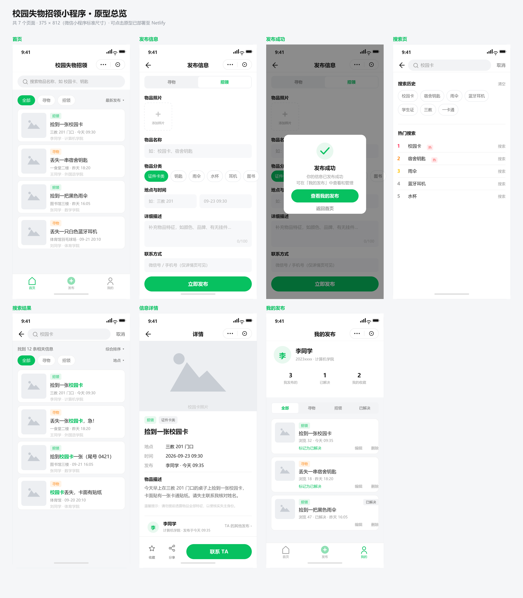
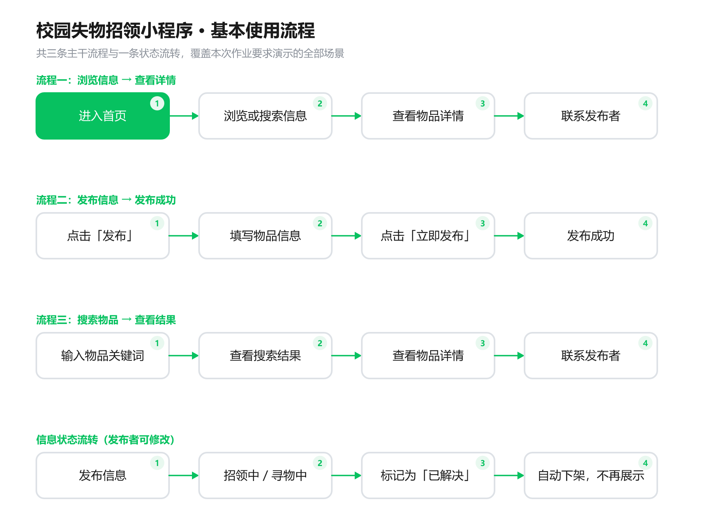

# 结对作业（第一次）：校园失物招领小程序 —— 需求分析与原型设计

> **学号1 姓名1　学号2 姓名2**

---

## 一、客户的问题出在哪

校园里丢东西很常见，丢了之后大家的第一反应是发到班级群、宿舍群或朋友圈。但这种方式毛病明显：**信息分散**，十几个群各发各的；**容易被淹没**，一条信息半小时就被聊天记录顶没了；**供需不对称**，在教学楼捡到校园卡的同学只能发在自己班群，失主很可能不在。结果是捡到的人在等、丢的人在找，两边在同一校园却碰不上。

## 二、用户是谁，他们要什么

目标用户很集中：**在校学生**，分**失主**和**拾得者**两类。两者诉求相反，但要做的是同一件事：找到对得上的那条信息，再联系对方。由此得出四个核心需求：**看得到**、**发得快**（一两分钟发完）、**搜得到**（记得物品名就能搜）、**联系得上**（看完详情能加到人）。

**不做的范围**同样明确：后台管理、实名认证、站内聊天、地图定位都不做。尤其是聊天——双方认识后自然会在微信里沟通，硬做聊天反而要求用户在陌生系统重建社交关系。

## 三、软件解决什么问题，有哪些功能

一句话概括：**把散落在各个群聊里、转瞬即逝的失物信息，集中到一个可分类、可搜索的入口**。

主要功能：浏览失物和招领信息（可筛选"全部/寻物/招领"）、发布寻物信息、发布招领信息、搜索物品（关键词高亮）、查看物品详情、联系发布者、修改信息状态（标记"已解决"后自动下架）、我的发布。

## 四、原型设计

原型用 HTML/CSS 手写为**可点击的高保真原型**，部署在 Netlify 上：不需要安装任何设计软件，打开链接即可逐页点击演示，页面上的绿色热区就是跳转入口。

**🔗 原型在线链接：<https://majestic-macaron-f0347e.netlify.app/>**

原型共 **7 个页面**：首页、发布信息、发布成功、搜索页、搜索结果、信息详情、我的发布。前 4 个为作业必需页，后 3 个用于演示两条流程和"修改信息状态"功能。

## 五、基本使用流程

三条主干流程：**查看信息 → 查看详情**（首页 → 详情 → 联系发布者）；**发布信息 → 发布成功**（填写 → 立即发布 → 成功 → 我的发布）；**搜索物品 → 查看搜索结果**（输入关键词 → 结果列表 → 详情）。

流程上还有一条闭环：发布者可将信息标记为"已解决"，标记后自动下架，避免已归还的物品继续占用别人的注意力。

## 六、结对过程

我们讨论了四次。第一次拆解问题，各自写下"最难受的一点"再合并，两个角度最后归一为"供需不对称"。第二次确定功能与页面，最大分歧是"联系发布者"要不要做站内留言，讨论后采纳队友意见改为展示微信号。

第三次原型评审，队友拿作业要求逐条对照，发现搜索流程少了"结果列表"，用户没法从多条结果里挑，于是补充了搜索结果页。

## 七、PSP 表格

| PSP 阶段 | 预估(分钟) | 实际(分钟) |
| --- | ---: | ---: |
| 计划 Planning | 20 | 25 |
| 需求分析 Analysis | 60 | 75 |
| 设计 Design | 90 | 105 |
| 原型制作 Prototype | 120 | 150 |
| 文档与博客 | 110 | 120 |
| 评审 Review | 30 | 35 |
| **合计** | **430** | **510** |

超时主要在需求分析与原型制作：前者起初只按客户描述列了 3 个痛点，访谈后才发现"信息格式不统一"同样重要；后者因 7 页分别制作导致样式不统一而返工。

## 八、个人总结

### 同学A（本人）

我负责基础功能：需求整理、流程图、原型页面和文档。最大的收获是学会**把"用户的抱怨"翻译成"产品的功能"**——客户说"群里消息太多找不到"只是抱怨，它对应"信息需要可检索"这个需求，再往下才是"做搜索功能"。

遇到的问题一是分不清需求和功能，后来用用户故事句式重写才浮出来；二是不确定原型要画多细，最后以"能演示三条流程"为标准才收回精力。

### 同学B

<!--
  ⚠️ 请队友在这里写自己的个人总结（建议 150–200 字）：
     1. 你在本次结对作业中负责了什么
     2. 最大的收获是什么
     3. 遇到的问题 / 自己还要提升的地方
     写完后请删掉这段注释。
-->

【此处由同学B撰写，约 150–200 字】
