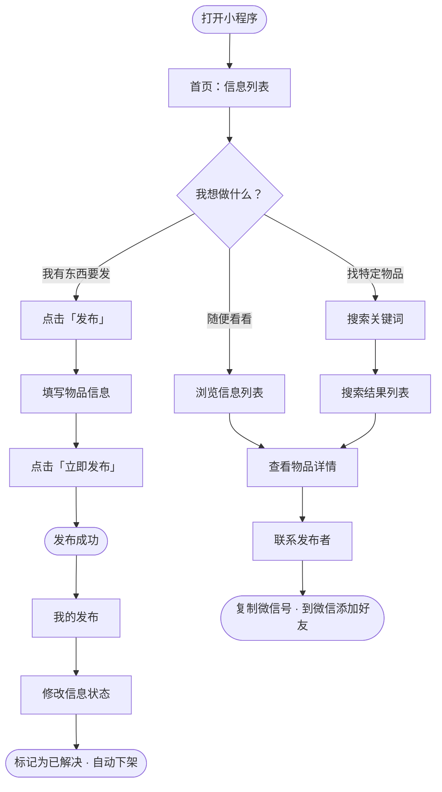
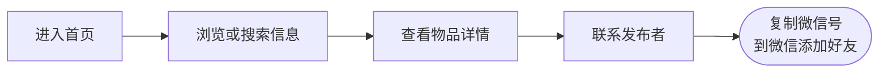
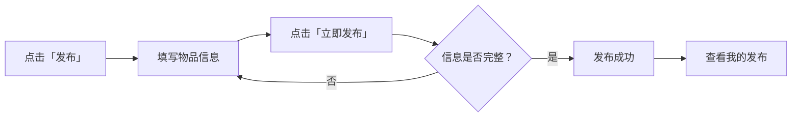
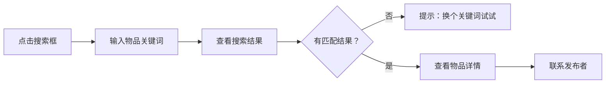
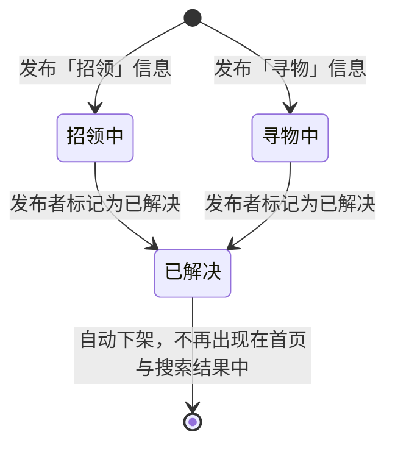
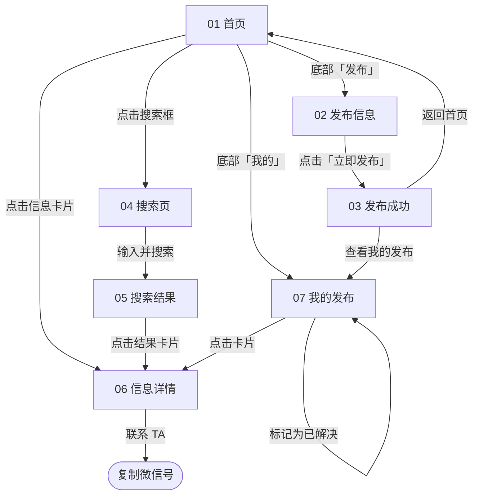

# 流程图

> 配图见 `docs/images/流程图-基本使用流程.png`（博客中直接引用此图）

## 一、总体使用流程

## 二、流程一：查看信息 → 查看详情 → 联系发布者

## 三、流程二：发布信息 → 发布成功

**填写物品信息**包含以下字段：

| 字段 | 是否必填 | 说明 |
| --- | --- | --- |
| 类型（寻物 / 招领） | ✅ | 表单顶部先选，决定信息归类 |
| 物品照片 | ⭕ 选填 | 最多 1 张，有照片的信息更容易被认出来 |
| 物品名称 | ✅ | 用于搜索匹配的核心字段 |
| 物品分类 | ✅ | 证件卡类 / 钥匙 / 雨伞 / 水杯 / 耳机 / 图书 |
| 地点与时间 | ✅ | 丢失或拾取的地点、时间 |
| 详细描述 | ⭕ 选填 | 颜色、品牌、有无挂件等特征，限 100 字 |
| 联系方式 | ✅ | 微信号或手机号，仅详情页可见 |

## 四、流程三：搜索物品 → 查看搜索结果

## 五、信息状态流转

**设计说明**：物品归还后，信息如果继续挂在首页，会浪费其他同学的时间，也会降低整个平台的可信度。因此详情页底部为发布者提供"标记为已解决"入口，标记后信息自动下架，只保留在"我的发布"中可查。

## 六、页面跳转关系

